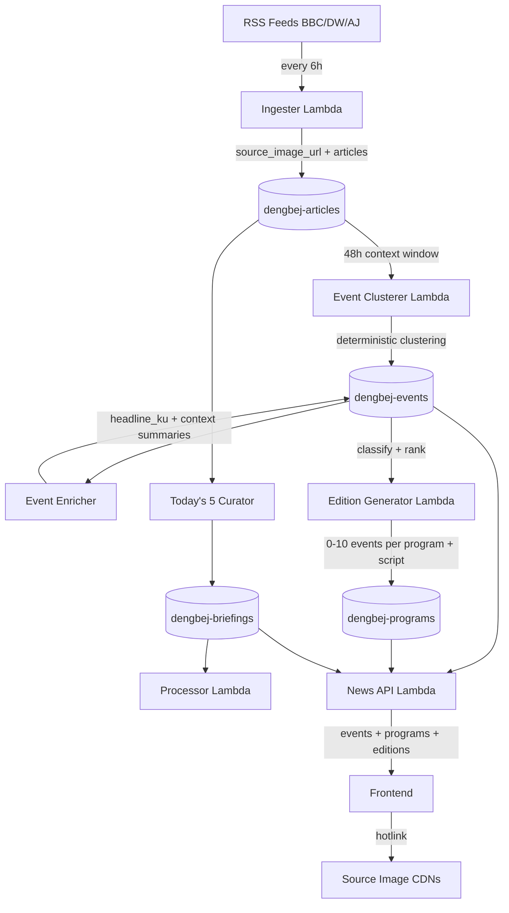

# Design Document: News Presentation V2 — Event + Context + Radio Edition Architecture

## Overview

News Presentation V2 transforms Dengbej AI from a story-list model to an event-centric Kurdish news radio experience. The architecture introduces three new layers:

1. **Event Layer** — Canonical news events that cluster multiple source articles about the same real-world development
2. **Program Context** — Rolling 48-hour editorial context per program for informed narration
3. **Radio Editions** — Curated selections of 0–10 important events narrated every 6 hours

The homepage remains radio-first with a new headline discovery rail. Users can click event headlines to read deeper context pages with clean canonical URLs (`/news/{slug}`).

**Key constraints:**
- One unified frontend (no separate apps)
- No TTS implementation
- No advertising implementation
- No new JS frameworks (vanilla HTML/CSS/JS)
- Zero additional Bedrock invocations for headlines (piggyback on existing calls)
- No image rehosting/downloading to S3
- Today's 5 remains exactly 5, logically separate
- Fingerprint-based idempotency preserved
- Event identity is stable and opaque (ULID); fingerprint tracks content version separately
- Canonical URLs use clean paths (`/news/{slug}`) not hash routes

## Architecture



### Pipeline Timing (proposed 6-hour cycle)

| Time (UTC) | Lambda | Purpose |
|------------|--------|---------|
| 00:00, 06:00, 12:00, 18:00 | News Ingester | Fetch RSS, store articles with images |
| 00:15, 06:15, 12:15, 18:15 | Event Clusterer | Cluster articles → canonical events |
| 00:20, 06:20, 12:20, 18:20 | Event Enricher | Generate headline_ku + context for new/updated events |
| 00:30, 06:30, 12:30, 18:30 | Edition Generator | Select events → radio narration scripts |
| 06:00, 18:00 | Today's 5 Curator | Separate editorial product (unchanged) |

**Rationale:** Each stage needs the previous stage's output. 5-15 minute gaps allow completion. The Enricher is a separate logical step from clustering to keep clustering fully deterministic.

## Data Models

### Recommendation: New `dengbej-events` Table

Events are a fundamentally new entity needing stable identity, canonical URLs, multi-program membership, and reusable AI-generated context. A new table is recommended.

### Event Identity vs Content (Adjustment 1)

**Permanent event identity** and **current content version** are strictly separated:

| Concept | Field | Mutability | Purpose |
|---------|-------|------------|---------|
| Identity | `event_id` | Immutable (set once at creation) | Stable reference for all internal lookups |
| Public URL | `slug` | Immutable (set once at creation) | Human-readable canonical URL |
| Content version | `fingerprint` | Changes when articles join/leave | Detect NEW/UPDATED/UNCHANGED |

**event_id strategy: ULID (Universally Unique Lexicographically Sortable Identifier)**

- Format: 26-character Crockford Base32 string (e.g., `01H5JBQE1DPXHN3FR5MJ6GWKTY`)
- Generated once at event creation, never changes regardless of source articles added
- Lexicographically sortable by creation time (useful for "latest events" queries)
- No collision risk (unlike truncated hashes)
- Python: `import ulid; event_id = str(ulid.new())`

**Why ULID over UUID/SHA:**
- UUID v4: random, not sortable by time
- SHA-256 of articles: changes when articles are added (violates stable identity requirement)
- ULID: time-ordered, unique, opaque, compact

**fingerprint** (content version):
- `SHA-256(sorted(source_article_ids))[:24]`
- Changes when an article is added to or removed from the event
- Used to detect whether the event's content has materially changed since last edition
- Adding another source article changes the fingerprint but NOT the event_id or slug

### Table: `dengbej-events`

| Field | Type | Description |
|-------|------|-------------|
| `event_id` | S (PK) | ULID — stable opaque identity, set once at creation |
| `slug` | S | URL-safe slug, immutable after creation |
| `headline_en` | S | Editorial English headline (from most prominent source) |
| `headline_ku` | S \| null | Canonical Kurdish headline (generated once by Enricher, reused) |
| `context_summary_en` | S \| null | AI-generated English context (what happened + latest) |
| `context_summary_ku` | S \| null | AI-generated Kurdish context |
| `source_article_ids` | L[S] | Contributing article IDs (grows as sources added) |
| `sources` | L[S] | Unique source names |
| `source_urls` | L[S] | All original article URLs |
| `image_url` | S \| null | Representative image (most recent source with image) |
| `image_source` | S \| null | Attribution for the selected image |
| `programs` | L[S] | Programs this event belongs to |
| `category` | S | Primary editorial category |
| `first_seen_at` | S | ISO timestamp of event creation |
| `updated_at` | S | ISO timestamp of last material update (article added) |
| `fingerprint` | S | SHA-256 of sorted article IDs (content change detection) |
| `editorial_score` | N | Computed deterministic significance score |
| `cross_source_count` | N | Number of unique sources |
| `last_narrated_at` | S \| null | When last included in a radio edition |
| `enriched_at` | S \| null | When headline_ku/context was last generated |

**GSI: `slug-index`** — PK: `slug`, projects all fields. For O(1) event page lookup by URL.

### Table: `dengbej-articles` (extended)

| Field | Type | Added by | Description |
|-------|------|----------|-------------|
| `source_image_url` | S \| null | Ingester | Hotlink from RSS media fields |
| `source_image_source` | S \| null | Ingester | Attribution (source_name) |
| `source_language` | S | Ingester | `en` for current sources |
| `event_id` | S \| null | Event Clusterer | Back-reference to canonical event |

Note: `headline_ku` lives on the EVENT, not the article. Articles preserve their original `headline` permanently.

### Table: `dengbej-programs` (Radio Editions)

Existing schema stays backward-compatible. New fields:

| Field | Type | Description |
|-------|------|-------------|
| `edition_cycle` | S | `00` \| `06` \| `12` \| `18` (which 6h cycle) |
| `event_ids` | L[S] | Ordered event IDs narrated in this edition |
| `events` | L[M] | Denormalized event data for efficient API reads |
| `edition_fingerprint` | S | SHA-256 of sorted event_ids (idempotency) |

## Components and Interfaces

### Event Clustering (Adjustment 5: Event Updates)

The Event Clusterer is fully deterministic (zero Bedrock):

**Initial event creation:**
1. Scan articles from last 48h without `event_id`
2. For each unclustered article, compare headline against existing recent events
3. If Jaccard similarity ≥ 0.40 with an existing event's headline(s): assign to that event
4. If no match found: cluster unclustered articles among themselves (same threshold)
5. New cluster → create new event (ULID, slug from headline, fingerprint)
6. Singleton article → create single-source event

**Adding a source to an existing event:**
1. New article ingested, Event Clusterer runs
2. Article headline matches existing event (similarity ≥ 0.40)
3. Article's `event_id` field set to the existing event's ID
4. Event's `source_article_ids`, `sources`, `source_urls` updated
5. Event's `fingerprint` recalculated (content version changes)
6. Event's `updated_at` set to now
7. Event's `cross_source_count` incremented
8. Event's `slug` and `event_id` remain unchanged (stable identity)

**When to regenerate canonical context:**
- `fingerprint` changed (new article added) AND event has existing `context_summary_en` → mark for re-enrichment
- Event Enricher checks: if `fingerprint` differs from `enriched_fingerprint` → regenerate context
- If event is brand new (no context yet) → generate on first enrichment

**Slug lifecycle (Adjustment 6):**
- Generated once from `headline_en` at event creation
- Algorithm: `lowercase → replace spaces/special with hyphens → strip consecutive hyphens → truncate to 60 chars`
- Collision handling: query `slug-index` for existing slug; if collision → append `-2`, `-3`, etc.
- **Slug never changes after creation**, even if headline_en is later refined
- This ensures URLs published/shared/indexed remain valid permanently

### Event Enricher — Canonical AI Generation (Adjustment 4)

A new logical step (can be part of the Edition Generator Lambda or a separate Lambda) that:

1. Queries events where `enriched_at IS NULL` OR `fingerprint != enriched_fingerprint`
2. For each such event, generates in ONE Bedrock call:
   - `headline_ku` (concise Kurdish editorial headline)
   - `context_summary_en` (2-4 sentence context: what happened, who, why it matters)
   - `context_summary_ku` (Kurdish translation of context)
3. Persists results back to `dengbej-events`
4. Sets `enriched_at` and `enriched_fingerprint`

**Key insight (Adjustment 4):** This enrichment happens ONCE per new/changed event, independent of how many programs the event appears in. If an event is in bakur, turkey, AND kurdistan — the enrichment cost is paid once, not three times.

**Enricher prompt (single call per event):**
```
Given this news event with N sources, generate:
1. A concise Kurdish Kurmanji headline (max 15 words)
2. A 2-4 sentence English context summary
3. A Kurdish Kurmanji translation of that context

Sources:
- [headline + description from each article]

Output JSON:
{"headline_ku": "...", "context_summary_en": "...", "context_summary_ku": "..."}
```

**Revised call-flow:**
- Enricher: 1 call per NEW or UPDATED event (not per program!)
- Edition Generator: 1 call per CHANGED program (radio script only, using pre-enriched event data)
- Programs reuse enriched `headline_ku`, `context_summary_en/ku` from the event record

### Edition Ranking Model (Adjustment 3)

Do NOT use NEW > UPDATED > UNCHANGED as absolute hierarchy. Instead, compute a unified `edition_rank_score` incorporating all signals:

```python
def compute_edition_rank_score(event, program_id, previous_edition_event_ids):
    """
    Unified ranking for radio edition selection.
    All qualifying events (score >= 2) are ranked by this composite score.
    """
    # Base editorial importance (0-5+)
    base = event["editorial_score"]  # cross_source_count + freshness bonus
    
    # Program relevance bonus (+0.5 if event has strong program affinity)
    # e.g., a PKK story is more relevant to "bakur" than "world"
    program_affinity = compute_program_affinity(event, program_id)
    
    # Freshness signal (0-1, linear decay over 48h)
    freshness = compute_freshness(event["updated_at"])
    
    # Cross-source corroboration (0-1, normalized)
    corroboration = min(event["cross_source_count"] / 4.0, 1.0)
    
    # State bonuses
    new_bonus = 1.5 if event["status"] == "new" else 0
    updated_bonus = 0.75 if event["status"] == "updated" else 0
    
    # Recently-narrated penalty (discourages repetition, doesn't block)
    recently_narrated = event["event_id"] in previous_edition_event_ids
    repetition_penalty = -1.0 if recently_narrated else 0
    
    # Composite score
    score = (
        base * 1.0 +
        program_affinity * 0.5 +
        freshness * 0.3 +
        corroboration * 0.3 +
        new_bonus +
        updated_bonus +
        repetition_penalty
    )
    return score
```

**Key behaviors:**
- A NEW event gets +1.5 bonus but a highly important UNCHANGED event (base=4) still outranks a marginal NEW event (base=2)
- Recently-narrated events get -1.0 penalty but aren't excluded — a major continuing story (base=5) remains eligible
- No absolute suppression of any state category
- Maximum 10, no padding, quality threshold (editorial_score >= 2) still applies as gate

### Edition Generator — Radio Script Composition

The Edition Generator now receives pre-enriched events and focuses solely on composing the radio narration:

```python
def generate_edition_script(selected_events, program_id, date_str, telemetry):
    """
    Generate radio script from pre-enriched events.
    Input: events already have headline_ku, context summaries.
    Output: coherent Kurmanji radio narration combining selected events.
    """
    # Build prompt using enriched event data (NOT raw article text)
    event_blocks = []
    for i, event in enumerate(selected_events, 1):
        block = f"Event {i}:\n"
        block += f"Headline: {event['headline_en']}\n"
        block += f"Kurdish headline: {event.get('headline_ku', 'N/A')}\n"
        block += f"Context: {event.get('context_summary_en', event.get('headline_en'))}\n"
        block += f"Sources: {', '.join(event['sources'])}\n"
        block += f"Category: {event['category']}"
        event_blocks.append(block)
    
    # Standard radio script prompt (reuses existing quality rules)
    # ...
```

This means the Edition Generator prompt contains compact, pre-digested event summaries rather than raw article descriptions — resulting in smaller input tokens per call.

### Canonical Event URLs (Adjustment 2)

**Design: Clean paths, not hash routes.**

Event pages use real paths: `/news/turkey-pkk-reintegration-law`

**Amplify rewrite configuration** (smallest change needed):

```json
{
  "rewrites": [
    {
      "source": "/news/<slug>",
      "target": "/index.html",
      "status": "200"
    }
  ]
}
```

This is configured in `amplify.yml` or the Amplify Console under "Rewrites and redirects". It tells Amplify to serve `index.html` for any `/news/*` path, allowing the frontend JavaScript to read `window.location.pathname` and render the appropriate event page.

**Frontend routing (vanilla JS):**
```javascript
// On page load, check pathname
var path = window.location.pathname;
if (path.startsWith("/news/")) {
    var slug = path.replace("/news/", "");
    loadEventPage(slug);
} else {
    loadHomepage();
}
```

**Benefits over hash routing:**
- Clean canonical URLs for SEO (`/news/slug` vs `/#/news/slug`)
- Shareable URLs work naturally on social media
- Compatible with future SSR/pre-rendering without URL changes
- `<link rel="canonical">` can reference the clean path

**No SSR in V2** — but the URL structure is SEO-ready. When SSR is added later, the same URLs continue working.

### SEO Metadata (V2 scope)

Even without SSR, the frontend sets metadata dynamically:
```javascript
document.title = event.headline_ku + " — Dengbej";
document.querySelector('meta[name="description"]').content = event.context_summary_en;
// OpenGraph: set dynamically (works for JS-executing crawlers like Twitter/Facebook)
```

The `amplify.yml` rewrite ensures crawlers receive `index.html` (with default meta) for any `/news/*` path. Full pre-rendering deferred to V3.

## Correctness Properties

### Property 1: Event Identity Stability
*For any* event, the `event_id` (ULID) and `slug` are set once at creation and never change, regardless of how many source articles are subsequently added to the event.

**Validates: Requirements 1.1, 3.1, 7.1**

### Property 2: Edition Selection Quality Threshold
*For any* radio edition, every narrated event has `editorial_score >= 2`, the count is 0-10 inclusive, and no event below threshold appears regardless of pool size.

**Validates: Requirements 3.1, 3.2, 3.3, 3.4, 3.5**

### Property 3: Canonical headline_ku Uniqueness
*For any* event, `headline_ku` is generated at most once (by the Enricher) and reused across all programs containing that event. Programs never independently generate headline translations for the same event.

**Validates: Requirements 2.1, 2.2, 2.3, 2.4**

### Property 4: Fingerprint Idempotency
*For any* unchanged edition (same event set, same edition_fingerprint), zero Bedrock calls are made and the existing script is reused.

**Validates: Requirements 2.3, 2.4, 3.6**

### Property 5: Image Graceful Degradation
*For any* event card, if `image_url` is null or image fails to load, the card renders without an image element and no broken-image icon is visible.

**Validates: Requirements 5.2, 5.5, 8.4**

### Property 6: Event Content Versioning
*For any* event, adding a new source article changes the `fingerprint` but does NOT change the `event_id` or `slug`.

**Validates: Requirements 1.1, 7.1**

## Error Handling

| Scenario | Behavior |
|----------|----------|
| Image HTTP error | `onerror` hides image wrapper; text-only card |
| Bedrock enrichment fails | Event retains null headline_ku/context; retry next cycle |
| Bedrock script generation fails | Script stays null; retry on next cycle (existing Task 11 behavior) |
| Event slug collision | Append numeric suffix (`-2`, `-3`) at creation time |
| Article similarity ambiguous (0.20-0.39) | Treat as separate events (conservative; avoids false merges) |
| API returns old format (no events) | Frontend falls back to existing stories[] rendering |
| `/news/{slug}` not found | Frontend renders 404 state with link back to homepage |
| Amplify rewrite miss | Returns index.html; JS handles gracefully |

## AI Cost Control (Revised — Adjustment 4)

### Revised Call-Flow with Event-Level Enrichment

The key insight: canonical event enrichment happens ONCE per event, not once per program.

```
48h articles (deterministic clustering) → ~30-50 events
    → ~5-15 NEW/UPDATED events per cycle → Enricher: 1 Bedrock call each
    → 8 programs × selection → Edition Generator: 1 call per CHANGED program
```

**Per 6-hour cycle:**

| Stage | Calls | Tokens (avg) |
|-------|-------|--------------|
| Event Enricher (new/updated events) | ~5-10 | ~400 in / ~300 out each |
| Edition Generator (changed programs) | ~3-4 | ~800 in / ~800 out each |
| Unchanged programs | 0 | — |
| Empty programs | 0 | — |
| **Cycle total** | **~8-14** | ~7,000 in / ~5,500 out |

**Comparison to previous estimate:**
- Previous: ~14 calls/day (3.5 per cycle × 4 cycles), all in Edition Generator
- Revised: ~8-14 calls/cycle split between Enricher + Edition Generator
- BUT Enricher calls are smaller (single event context vs multi-event script)
- AND Edition Generator calls are smaller (pre-digested event summaries vs raw article descriptions)

**Revised Daily/Monthly Cost:**

| Period | Enricher calls | Edition calls | Total calls | Input tokens | Output tokens | Cost |
|--------|---------------|---------------|-------------|-------------|---------------|------|
| Per cycle | ~7 | ~3.5 | ~10.5 | ~5,600 | ~4,200 | $0.021 |
| Daily (4 cycles) | ~28 | ~14 | ~42 | ~22,400 | ~16,800 | $0.085 |
| Monthly | ~840 | ~420 | ~1,260 | ~672,000 | ~504,000 | **~$2.55** |

*Claude Haiku 4.5: $0.80/M input, $4.00/M output*

**vs previous estimate of $2.08/month:** Slightly higher call count but individual calls are smaller. The tradeoff is better reuse — an event enriched once serves all programs that reference it without regeneration.

**Scaling with more Kurdish sources:**
- More sources → more articles per event → higher cross_source_count → same number of events
- Enricher calls: roughly the same (same number of events, just more sources per event)
- Impact of +3 Kurdish sources: ~$0.30-0.50/month additional

### Fingerprint-Based Idempotency (Preserved)

- **Event fingerprint:** SHA-256 of sorted source_article_ids. Changes when articles added.
- **Edition fingerprint:** SHA-256 of sorted selected event_ids. Changes when different events selected.
- **Enricher idempotency:** Only enriches events where `fingerprint != enriched_fingerprint`
- **Edition Generator idempotency:** Only generates script where `edition_fingerprint` differs from previous

### Image Strategy

- RSS extraction: `media:content → media:thumbnail → enclosure → null`
- Event representative image: most recent source article with an image
- Direct hotlink, `loading="lazy"`, `onerror` collapse
- No S3 rehosting, no article-page scraping
- Image attribution from `source_name` of providing article

## TTS Path (Preserved, Not Implemented)

```
Event selection → script_ku → [FUTURE: TTS] → S3 audio → audio_url → Bêje!
```

No architectural changes needed when TTS arrives. Each radio edition stores `script_ku` and `audio_url` (null until TTS exists).

## Frontend Architecture

### Clean Path Routing (Adjustment 2)

| Path | View | Data source |
|------|------|-------------|
| `/` | Homepage: radio + headline rail | `/news/events/latest` + `/news/program/{id}` |
| `/news/{slug}` | Event detail page | `/news/event/{slug}` |

Amplify rewrite ensures all `/news/*` paths serve `index.html`. Frontend reads `window.location.pathname`.

### Homepage Layout

```
┌─────────────────────────────────────────────────┐
│ DENGBEJ                          [English][Kurdî] │
├─────────────────────────────────────────────────┤
│ Nûçeyên Dawî / Latest                            │
│ ← headline | headline | headline | headline →    │
│   (scrollable rail, links to /news/{slug})       │
├─────────────────────────────────────────────────┤
│ Çi bêjim?                                        │
│ [Nûçeyên Îro][Kurdistan][World][Turkey]...        │
│ ┌───────────────────────────────────────────┐    │
│ │ Radio Card + Bêje! + script_ku            │    │
│ └───────────────────────────────────────────┘    │
│ Event cards (0-10) with images                    │
└─────────────────────────────────────────────────┘
```

### Headline Rail
- `overflow-x: auto` with `scroll-snap-type: x mandatory`
- Not auto-scrolling ticker
- Mobile: swipeable; Desktop: scroll/arrows
- Keyboard accessible (`tabindex`, arrow keys)
- `prefers-reduced-motion`: no animations
- Each headline → `<a href="/news/{slug}">`
- Kurdish mode → `headline_ku`; English → `headline_en`

### Event Detail Page
- Semantic HTML sections for future ad compatibility
- Kurdish headline primary, English secondary
- Context summary (language-switched)
- Source attribution with original links
- Image with `onerror` fallback
- Programs listed, timestamps shown
- Future: Bêje! audio integration, related events

### Future Advertising Compatibility
- DOM uses semantic `<section>` elements with predictable classes
- Natural gaps between context/sources/programs for future ad insertion
- No ad code, tracking, or SDKs added now

## Testing Strategy

### Test Suites

| Suite | Estimated Tests | Coverage |
|-------|----------------|----------|
| `test_image_extraction.py` | ~10 | RSS priority, validation |
| `test_event_clustering.py` | ~15 | Clustering, ULID creation, slug, fingerprint, article assignment |
| `test_event_enricher.py` | ~8 | Enrichment calls, idempotency, canonical reuse |
| `test_edition_selection.py` | ~12 | Ranking model, threshold, max 10, repetition penalty |
| `test_event_api.py` | ~10 | New endpoints, slug lookup, backward compat |
| Frontend (manual + basic) | ~10 | Routing, headline rail, event page, language switching |

Current baseline: 170 tests. Expected new total: ~235 tests.

## Terraform / Infrastructure Changes

### New Resources

| Resource | Type |
|----------|------|
| `dengbej-events` DynamoDB table + slug GSI | `aws_dynamodb_table` |
| Event Clusterer Lambda + IAM + EventBridge | `aws_lambda_function` + supporting |
| Event Enricher (may be combined with Edition Generator) | `aws_lambda_function` or inline |
| Amplify rewrite rule | Amplify Console config |

### Modified Resources

| Resource | Change |
|----------|--------|
| News Ingester Lambda | Code: add image extraction |
| Program Generator → Edition Generator | Code: event-based, ranking model |
| Program Generator EventBridge | Schedule: `cron(30 0,6,12,18 * * ? *)` (4x daily) |
| News API Lambda + IAM | Code: new endpoints; IAM: events table read |

### Migration / Rollout

**Phase 1 (Foundation):** Create events table, deploy Ingester with images, deploy Event Clusterer
**Phase 2 (Enrichment):** Deploy Event Enricher, canonical headline_ku generation
**Phase 3 (Editions):** Evolve Program Generator into Edition Generator with ranking model
**Phase 4 (Frontend):** Headline rail, event pages, clean URL routing, Amplify rewrite
**Phase 5 (Cleanup):** Remove old story-list code paths after verification

Each phase is independently deployable with zero downtime.
